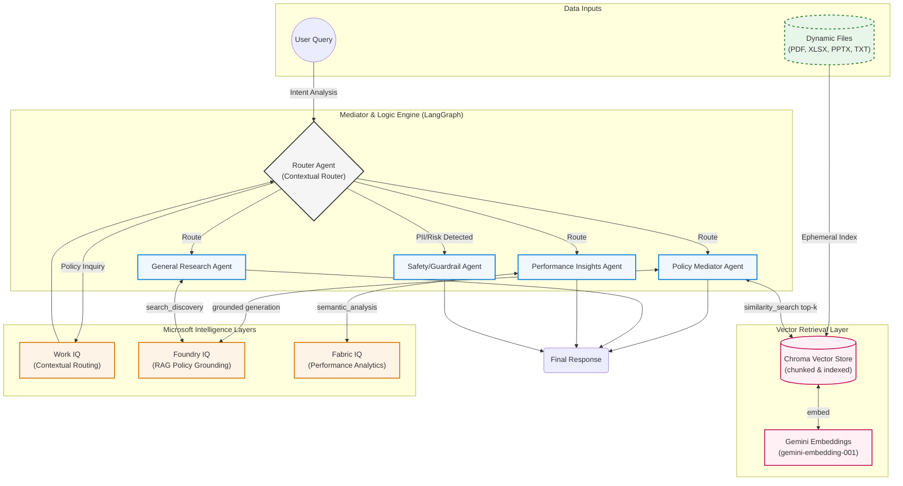

User-uploaded documents get the same treatment via an ephemeral, session-scoped Chroma index — built once per upload, queried the same way, never persisted, so nothing sensitive lingers after the session ends.

## Architecture Diagram:



---

## 📊 Key Features
* **Real Vector-Based RAG** — Chroma + Gemini embeddings, not context-stuffing dressed up as retrieval.
* **Multi-Format Support** — Seamlessly processes PDF, XLSX, PPTX, and TXT files via an intuitive sidebar uploader.
* **Autonomous Router** — Automatically classifies requests and selects the best agent for the task.
* **Observability** — Built-in Reasoning Traces in the UI let you monitor the agent's logic flow in real time.
* **Ephemeral User-Upload Indexing** — Session-scoped vector index for uploaded docs; nothing persists after you close the tab.

---

## 🛡️ Responsible AI & Security
* **Input Guardrails** — A proactive `safety_node` intercepts PII/credential-related requests at the router level, before they ever reach a reasoning node.
* **Secrets Hygiene** — API keys live exclusively in `.env` (gitignored) locally and in Streamlit Cloud's Secrets manager in production; never committed, never hardcoded. Git history has been scrubbed of any prior exposure.
* **Fictional Sample Data** — The pre-loaded `policy.txt` and `synthetic_learners.json` are illustrative, not real company data — clearly labeled as such in the UI.
* **Production Ready** — Architected to transition to **Azure Key Vault** and **Managed Identities** for enterprise-grade secrets management.

---

## 🏠 User Interface & Experience

* **Unified Control Array** — A sidebar "Command Center" for uploading custom policy/performance documents, clearing conversation history, and verifying active intelligence layers.
* **Transparent Reasoning** — Every response ships with a Reasoning Trace expander showing which path the router took and which IQ layer was consulted.
* **Interactive Context Awareness** — Real-time feedback on whether you're grounded in default or custom-uploaded context.


---

## 📸 Demonstration of Capabilities

* **Contextual Policy Arbitration** — Cross-references retrieved policy chunks to answer complex business rules regarding contract terms.


* **Proactive Safety Guardrails** — Automatically detects and blocks requests involving sensitive PII or security risks.


* **Boundary-Aware Logic** — Maintains strict adherence to retrieved context, refusing to hallucinate outside the provided policy domain.


---

## ❓ Frequently Asked Questions

### 1. How is this different from standard chatbots like ChatGPT or Gemini?
Standard AI tools operate as "black boxes" relying on broad, static training data. The Mediator & Logic Engine is a **durable, enterprise-grade framework**: every response is traced back to a specific, retrieved chunk of your policy or data via LangGraph's deterministic execution path, minimizing hallucination and preserving auditability.

### 2. Why use this instead of a simple RAG application?
Most "RAG" demos skip the "R" — they just paste an entire document into the prompt and call it retrieval. This engine performs **real retrieval**: documents are chunked, embedded with Gemini's embedding model, indexed in Chroma, and queried via similarity search at inference time, returning only the top-k relevant chunks. On top of that retrieval layer sits an **Active Arbitrator** — a Work IQ router for intent classification, Safety Guardrails for risk interception, and a Fabric IQ layer for structured-data reasoning that doesn't need chunking at all.

### 3. How secure is my data within this system?
Sensitive requests are intercepted by `safety_node` at the router level before reaching any reasoning node. API keys are never hardcoded or committed — they're managed via `.env` locally (gitignored) and Streamlit Cloud Secrets in production, with a documented path to Azure Key Vault and Managed Identities for enterprise deployment.

### 4. Can I use this for departments outside Sales and HR?
Yes — Dynamic Context Ingestion makes the system domain-agnostic. Upload HR handbooks, IT security protocols, legal compliance documents, or technical specs, and the vector index adapts instantly with zero code changes.

### 5. What makes the Reasoning Trace feature important?
In an enterprise setting, "yes" or "no" isn't enough — you need to know *why*. The Reasoning Trace reveals which IQ layer was consulted, which retrieved chunk triggered the decision, and what path the router took, giving the transparency corporate governance requires.

---

## 🔗 Project Quick Links

| Resource | Link |
| :--- | :--- |
| **Source Code** | [GitHub Repository](https://github.com/SaiKarthikeya1706/agents-league-mediator) |
| **Live Demonstration** | [Streamlit App](https://agents-league-mediator.streamlit.app/) |

---

## ⚙️ Quick Start Guide

```bash
# 1. Clone the repository
git clone https://github.com/SaiKarthikeya1706/agents-league-mediator
cd agents-league-mediator

# 2. Set up environment
python3 -m venv venv
source venv/bin/activate

# 3. Install dependencies
pip install -r requirements.txt

# 4. Configure your API key
echo "GOOGLE_API_KEY=your_key_here" > .env

# 5. Build the vector index (one-time, or whenever policy.txt changes)
python -m src.ingest

# 6. Launch the application
streamlit run src/app.py
```

> **Note:** Step 5 is required before first run — it builds the Chroma vector store that grounds every policy query. If you update `data/policy.txt`, re-run `python -m src.ingest` to refresh the index.

---

## 🧪 Tech Stack

`LangGraph` · `Google Gemini 2.5 Flash` · `Gemini Embeddings (gemini-embedding-001)` · `Chroma` (via `langchain-chroma`) · `Streamlit` · `PyPDF` · `python-pptx` · `pandas`