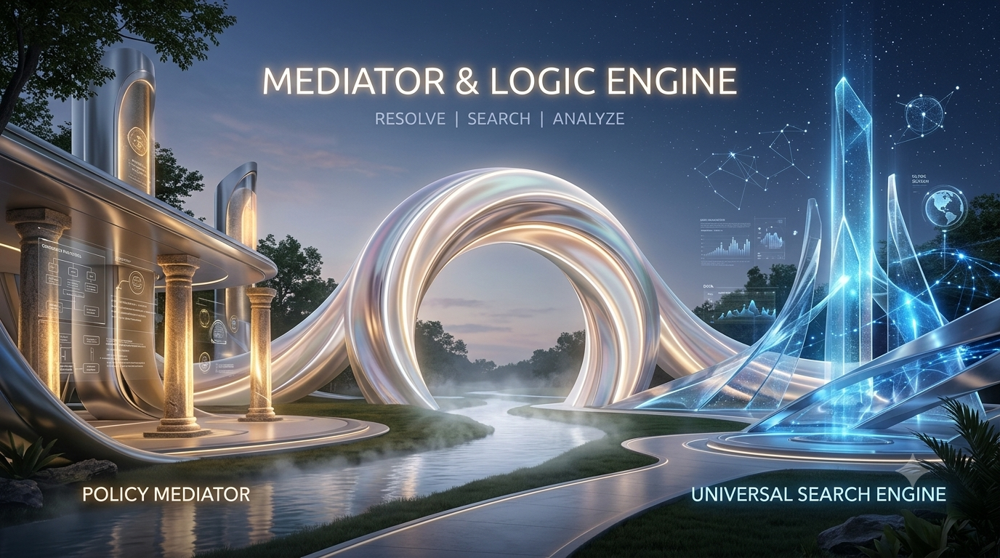

# Mediator & Logic Engine: Autonomous Enterprise Arbitration Framework



## 🧠 Challenge Submission
**Track:** Reasoning Agents with Microsoft Foundry  
**Project Objective:** A dual-purpose analytical platform that combines strict organizational policy arbitration (**The Mediator**) with a powerful, search-enabled engine for real-time information discovery and complex problem-solving (**The Logic Engine**).

---

## ⚖️ The Problem
In modern enterprise environments, requests (such as sales discounts) often lead to friction between departments. Manual, human-in-the-loop approvals are slow, inconsistent, and suffer from "precedent creep." Furthermore, current agents often lack the ability to bridge the gap between static policy and real-time business data analysis.

## 🚀 Our Solution
The **Mediator & Logic Engine** is a durable, Python-based orchestration framework built with **LangGraph**. It replaces manual gatekeeping with an autonomous **Reasoning Engine** that:

1. **Policy Mediator (Foundry IQ Pattern):** Uses a dynamic RAG-based arbitration engine to ground all decisions in verified, company-approved `data/policy.txt` documentation.
2. **Universal Logic Engine (Reasoning & Orchestration):** Leverages LangGraph to create durable, multi-step reasoning loops, ensuring the agent follows a strict logical path (Router → Policy/Search/Insights → Response).
3. **Data-Driven Insights (Fabric IQ Pattern):** Analyzes structured synthetic team performance data (`data/synthetic_learners.json`) to provide manager-level insights, enabling the agent to reason beyond simple text retrieval.

---

## 🛠️ Technical Architecture & IQ Mapping

| Microsoft IQ Layer | Our Implementation | Technical Purpose |
| :--- | :--- | :--- |
| **Foundry IQ** | `policy_node` (RAG Pattern) | Grounds policy rulings in a verified, version-controlled source. |
| **Fabric IQ** | `insights_node` (Semantic Analysis) | Analyzes structured team performance data for business metrics. |
| **Work IQ** | `router_node` (Contextual Routing) | Routes intent to the correct department-specific agent. |

## 📊 Key Features
* **Autonomous Router:** Automatically classifies requests as "Policy Compliance," "General Research," or "Team Insights."
* **Policy Mediator:** Provides structured, cited rulings based on real-time policy file updates.
* **Logic & Insights Engine:** Performs research and reasons over synthetic learner datasets to evaluate operational risk.
* **Observability:** Built-in **Reasoning Traces** in the UI allow developers to monitor the agent's logic flow in real-time.

---

## 🛡️ Responsible AI & Security
* **Input Guardrails:** The system implements a proactive `safety_node` to intercept sensitive data (PII/Credentials) at the router level.
* **Synthetic Data Hygiene:** All datasets are strictly synthetic, adhering to enterprise security standards. No real customer or employee records were used.
* **Production Strategy:** While this prototype uses local environment variables, the system is architected to transition to **Azure Key Vault** for secrets and **Managed Identities** for secure authentication in a production enterprise environment.

---

## ⚙️ Quick Start Guide

To run the **Mediator & Logic Engine** locally, use the following commands in your terminal:

```bash
# 1. Clone the repository
git clone <your-repository-url>
cd agents-league-mediator

# 2. Create and activate a virtual environment
python3 -m venv venv
source venv/bin/activate  # On Windows, use: venv\Scripts\activate

# 3. Install dependencies
pip install -r requirements.txt

# 4. Configure environment variables
# Create a .env file and add your Google API Key
echo "GOOGLE_API_KEY=your_actual_api_key_here" > .env

# 5. Launch the application
python3 -m streamlit run src/app.py