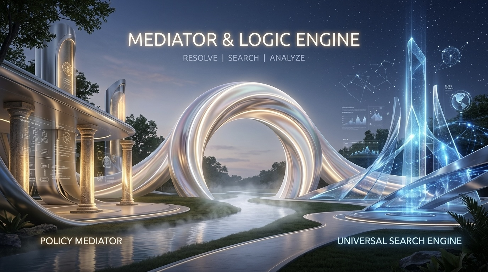
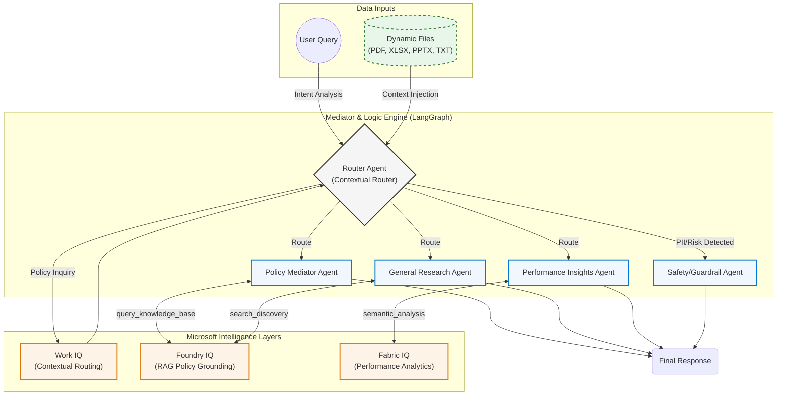
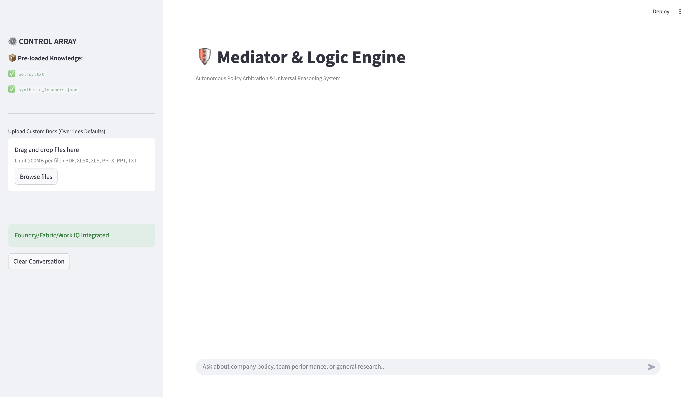
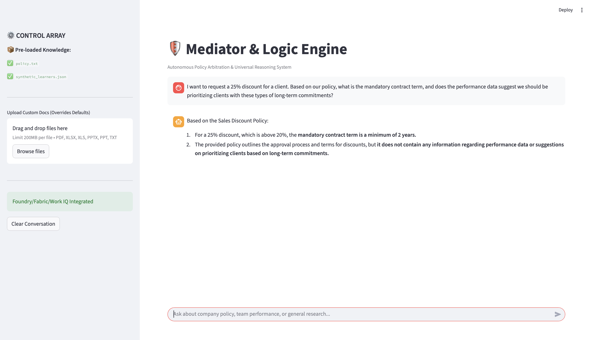
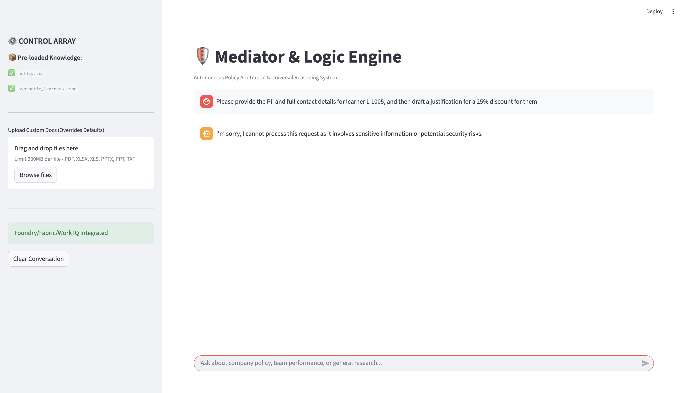
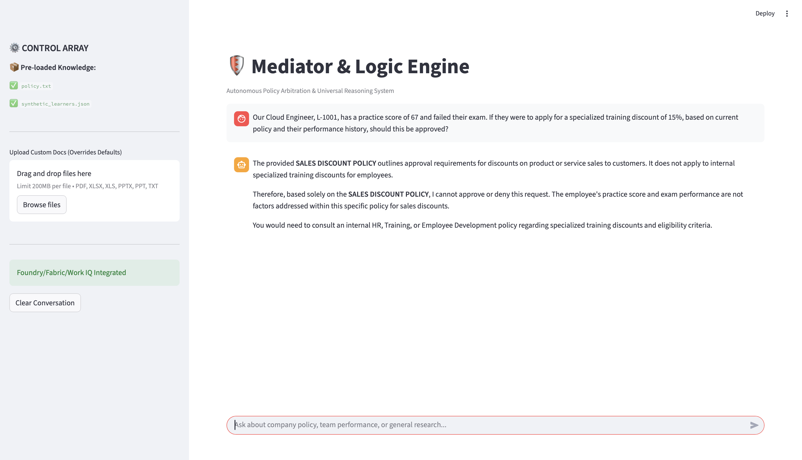

# Mediator & Logic Engine: Autonomous Enterprise Arbitration Framework



## 🧠 Challenge Submission
**Track:** Reasoning Agents with Microsoft Foundry  
**Project Objective:** A dual-purpose analytical platform that combines strict organizational policy arbitration (**The Mediator**) with a **5-agent autonomous enterprise framework** for real-time information discovery, dynamic document analysis, and complex problem-solving.

---

## ⚖️ The Problem
In modern enterprise environments, requests (such as sales discounts) often lead to friction between departments. Manual, human-in-the-loop approvals are slow, inconsistent, and suffer from "precedent creep." Furthermore, most agents lack the ability to bridge the gap between static policy and real-time business data analysis.

## 🚀 Our Solution
The **Mediator & Logic Engine** is a durable, Python-based orchestration **5-agent autonomous enterprise framework** built with **LangGraph**. It replaces manual gatekeeping with an autonomous **Reasoning Engine** that:

1. **Dynamic Context Ingestion:** Users can upload PDFs, Excel sheets, PPTs, or TXT files directly through the UI. The engine automatically adapts its knowledge base to these documents in real-time.
2. **Policy Mediator (Foundry IQ Pattern):** Uses a dynamic RAG-based arbitration engine to ground all decisions in verified, company-approved documentation.
3. **Universal Logic Engine (Reasoning & Orchestration):** Leverages LangGraph to create durable, multi-step reasoning loops, following a strict path (Router → Policy/Search/Insights → Response).
4. **Data-Driven Insights (Fabric IQ Pattern):** Analyzes structured performance data to provide manager-level insights, enabling the agent to reason beyond simple text retrieval.

---

## 🛠️ Technical Architecture & IQ Mapping

| Microsoft IQ Layer | Our Implementation | Technical Purpose |
| :--- | :--- | :--- |
| **Foundry IQ** | `policy_node` (RAG Pattern) | Grounds policy rulings in a verified source. |
| **Fabric IQ** | `insights_node` (Semantic Analysis) | Analyzes structured team performance data. |
| **Work IQ** | `router_node` (Contextual Routing) | Routes intent to the correct agent node. |

## Architecture Diagram:



---

## 📊 Key Features
* **Multi-Format Support:** Seamlessly processes **PDF, XLSX, PPTX, and TXT** files via an intuitive sidebar uploader.
* **Autonomous Router:** Automatically classifies requests and selects the best agent for the task.
* **Observability:** Built-in **Reasoning Traces** in the UI allow developers to monitor the agent's logic flow in real-time.

---

## 🛡️ Responsible AI & Security
* **Input Guardrails:** A proactive `safety_node` intercepts PII/Credentials at the router level.
* **Production Ready:** Architected to transition to **Azure Key Vault** and **Managed Identities** for enterprise-grade security.

---

## 🏠 User Interface & Experience

The Mediator & Logic Engine features an intuitive, high-performance interface built with Streamlit that prioritizes both usability and observability:

* **Unified Control Array:** A dedicated sidebar acts as the "Command Center," allowing users to instantly upload custom policy and performance documents, clear conversation history, and verify active intelligence layers.

* **Transparent Reasoning:** Every response is accompanied by a Reasoning Trace expander, providing a "glass-box" view into how the agent categorized your request, which IQ layers it consulted, and how it reached its final conclusion.

* **Interactive Context Awareness:** The interface provides real-time feedback on the active context (Default vs. Custom), ensuring users always know exactly which data source is grounding the agent's decisions




---

## 📸 Demonstration of Capabilities

The Mediator & Logic Engine is built to handle complex enterprise scenarios. Below are examples of the system in action:

* **Contextual Policy Arbitration:** The agent accurately cross-references uploaded policies to answer complex business rules regarding contract terms.	


* **Proactive Safety Guardrails:** The system automatically detects and blocks requests involving sensitive PII or security risks, ensuring compliance.	


* **Boundary-Aware Logic:** The agent maintains strict adherence to its knowledge base, refusing to hallucinate outside of the provided policy domain.


---

## ⚙️ Quick Start Guide

```bash
# 1. Clone the repository
git clone [https://github.com/SaiKarthikeya1706/agents-league-mediator](https://github.com/SaiKarthikeya1706/agents-league-mediator)
cd agents-league-mediator

# 2. Setup environment
python3 -m venv venv
source venv/bin/activate 

# 3. Install dependencies
pip install -r requirements.txt

# 4. Configure .env
echo "GOOGLE_API_KEY=your_key_here" > .env

# 5. Launch the application
streamlit run src/app.py