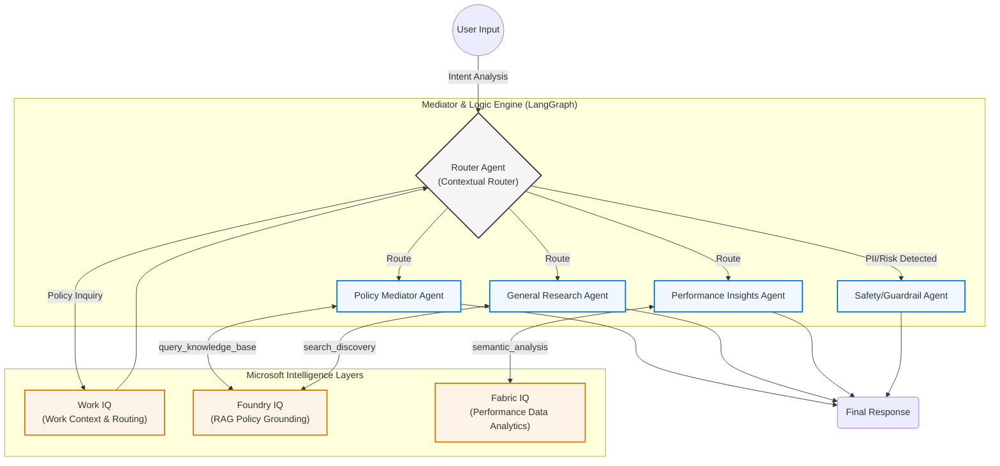

# System Architecture: Mediator & Logic Engine

## 1. Architectural Overview
The Mediator & Logic Engine is built on a **Stateful Orchestration Pattern** using LangGraph. The core design principle is **decoupling**: we isolate knowledge (Data Layer), reasoning (Agent Nodes), and context (Router/State).

## 2. Agent Logic Flow
The system operates as a finite state machine. The `router_node` determines the path, and the state dictionary (`AgentState`) maintains the conversation history and decision trail.

## 3. IQ Layer Integration Deep-Dive

### Foundry IQ (Policy Grounding)
The `policy_node` does not rely on LLM training data. It utilizes a **RAG-lite pattern** where the `policy.txt` file is injected into the system prompt context at runtime. This ensures the model treats the policy as the absolute source of truth.

### Fabric IQ (Business Logic)
The `insights_node` performs **Semantic Reasoning**. By passing the structured `synthetic_learners.json` (a JSON object) into the LLM, we allow the agent to treat "Role," "Status," and "Readiness" as **first-class entities** rather than simple text tokens.

### Work IQ (Contextual Awareness)
The `router_node` functions as the **Cognitive Gatekeeper**. It uses an LLM-based classifier to map user intent into specific execution paths, ensuring that sensitive requests or complex queries are handled by the appropriate specialized node.

## 4. Design Decisions

* **State Management:** We use `Annotated[List[BaseMessage], operator.add]` within LangGraph. This ensures that every node in the graph has access to the full conversation context (Chat History) without needing to manually pass session data.
* **Safety Fallback:** The safety check is placed at the **entry point** (The Router). By intercepting potentially sensitive inputs *before* they hit the specialized reasoning nodes, we reduce the blast radius of any "hallucination" or "prompt injection" risks.
* **Modularity:** Each agent node is designed as a standalone function. This makes it trivial to swap the `search_node` for a more complex tool-calling agent (e.g., Tavily Search) in the future without refactoring the core graph.